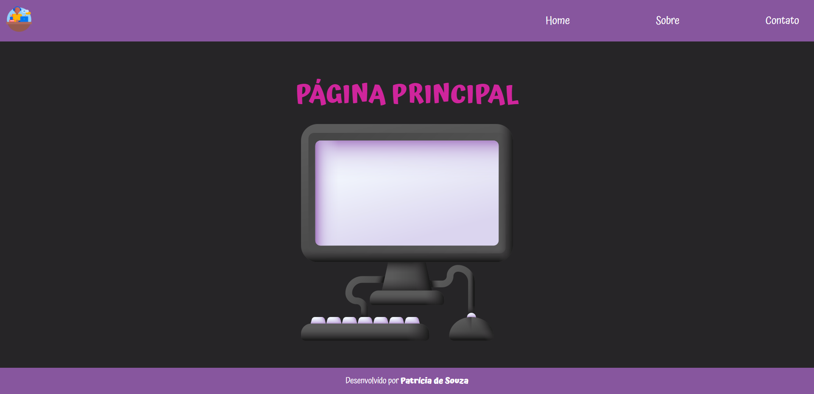

<h1 align="center"> Tutorial Django </h1>


<p align="center">
  
</p>

```
Sumário
1 - Criar o ambiente virtual
2 – Ativar/Carregar o ambiente virtual
3 - Instalar as bibliotecas e criar arquivo requirements	
4 - Iniciar/criar projeto na pasta raiz (setup/config)	
    4. 1 - Selecionar a versão Python da venv
5 – Alterar idioma e TIME_ZONE do nosso projeto (setup)	
6 – Criar variáveis de ambiente para a SECRET_KEY (Biblioteca dotenv)	
7 – Criar o APP e Configurar rotas	
    7.2 - Configurar as rotas (urls.py) do app no setup
8 – Configurar o APP	
    8.2 - Configurando arquivos estáticos (css, img, js)
    8.3 - Configurando views.py
9 – Configurar o html base	
10 – Criar as Partials	
```

Antes de criar o ambiente virtual, abra o Power Shell como administrador e digite o comando abaixo para os scripts funcionarem  
(Caso ainda não tenha feito isso):  

`et-ExecutionPolicy Unrestricted -Force`  

## 1 - Criar o ambiente virtual  

`python -m venv nomedavenv`  

Exemplo:
`python -m venv venv`  


## 2 – Ativar/Carregar o ambiente virtual  

`nomedavenv\Scripts\activate`  

`venv\Scripts\activate`  

## 3 - Instalar as bibliotecas e criar arquivo requirements  

Instalar o Django (com a venv ativada):  
`pip install django`

Instalar o pillow para trabalhar com imagens:  
`pip install django pillow`

Atualizar a versão do pip (não é obrigatório):
`python.exe -m pip install --upgrade pip`

Lista todas as dependências/bibliotecas python que estão atualmente instaladas em seu ambiente virtual:
`pip freeze`

Colocar essas dependências dentro do arquivo requirements:
`pip freeze > requirements.txt`

 

## 4 - Iniciar/criar projeto na pasta raiz (setup/config)
OBS: venv deve estar ativada
OBS: Um projeto pode ter vários apps dentro dele.

•	É recomendado usar o nome do projeto como 'config' ou 'setup'

Iniciar/ativar:
`django-admin startproject setup .`
•	O ponto é para não criar subpasta e já criar na pasta raiz  
 


### 4. 1 - Selecionar a versão Python da venv:  
#### CTRL + SHIFT + P  

Escrever ou Selecionar “Python: Selecionar Interpretador”  


Depois selecione a versão do python que está na venv:  
 


## 5 – Alterar idioma e TIME_ZONE do nosso projeto (setup)
Vamos em settings.py (dentro de setup) e alteramos :
```
LANGUAGE_CODE = 'pt-BR'
TIME_ZONE = 'America/Sao_Paulo'
```

Rodar o servidor para ver se está tudo ok:
`python manage.py runserver`

## 6 – Criar variáveis de ambiente para a SECRET_KEY - (Biblioteca dotenv)

A biblioteca dotenv é uma ferramenta útil no desenvolvimento de aplicativos Django em Python. Ela é usada para carregar variáveis de ambiente a partir de um arquivo chamado .env e torná-las disponíveis para seu aplicativo.  
Essas variáveis de ambiente podem conter configurações sensíveis, como chaves de API, senhas de banco de dados e outras informações confidenciais.  
Quando for colocar seu projeto em produção no GitHub, você pode usar o .gitignore para ignorar esse arquivo .env para não subir ao GitHub, já que tem as chaves do seu projeto.  

Instalar a dependência do python:  
`pip install python-dotenv`

Após Instalar essa dependência é necessário atualizar o arquivo requirements:  
`pip freeze > requirements.txt`  

Criar o arquivo .env na pasta raiz:  
 


Agora precisamos pegar o SECRET_KEY, que fica na pasta do projeto (setup), em “settings.py”:  
`SECRET_KEY = 'django-insecure-c8skwe%j(8azc=4ff%rqs-&*xy_+70tf-i'`  

Copiamos essa key e colamos no arquivo .env, tirando as aspas do código:  
`SECRET_KEY = django-insecure-c8skwe%j(8azc=4ff%rqs-&*xy_+70tf-i`  

Voltamos na pasta setup, em settings.py e vamos alterar a chave e fazer as importações a seguir:  
```
from pathlib import Path, os
from dotenv import load_dotenv

load_dotenv()
```

Acima adicionamos o "os" na importação, para conseguir manipular os arquivos:  
`from pathlib import Path, os`
e importamos o “load_dotenv” do módulo (dotenv) que instalamos:  
`from dotenv import load_dotenv`
Para carregar essas variáveis de ambiente,  chamamos a função:  
`load_dotenv()`


Na parte da SECRET_KEY, devemos indicar o caminho do arquivo .env que criamos e onde colocamos as chaves:  
`SECRET_KEY = str(os.getenv('SECRET_KEY'))`  

Precisamos criar o arquivo .gitignore na pasta raiz, ele que vai fazer com que o arquivo .env não vá para o GitHub quando fizer o push:  


Gerar o arquivo .gitignore no site:  
https://www.toptal.com/developers/gitignore/  
   


Digite `django` na busca e clique em `Criar`.  
Copie todo o código e cole no arquivo `.gitignore`;  
Observe que o arquivo `.env` consta na lista.  

## 7 – Criar o APP e Configurar rotas  


`python manage.py startapp nomedoapp`  

`python manage.py startapp blog`  

Precisamos adicionar esse app no setup do projeto, em settings:  

```
INSTALLED_APPS = [
    'django.contrib.admin',
    'django.contrib.auth',
    'django.contrib.contenttypes',
    'django.contrib.sessions',
    'django.contrib.messages',
    'django.contrib.staticfiles',
    'blog',
]
```

### 7.1 - Configurar as rotas (urls.py) do app  

Criar o `arquivo urls.py` no app ‘blog’ e importar todos os views do app;  
Informar também quais views(urls) esse app terá, nesse caso terá 3 páginas: index, sobre e contato.  

```
from django.urls import path
from blog import views

urlpatterns = [
    path('', views.index, name="index"),
    path('sobre/', views.sobre, name="sobre"),
    path('contato/', views.contato, name="contato"),
]

#urls -> view -> template
#template -> view -> urls
```

“name=” serve para referenciar os links no html base:  

```
<li><a href="">Home</a></li>
<li><a href="">Sobre</a></li>
<li><a href="">Contato</a></li>
```

### 7.2 - Configurar as rotas (urls.py) do app no setup  

Aqui informamos ao projeto todas as urls, de todos os apps, inclusive da página de administrador.  

```
from django.contrib import admin
from django.urls import path, include

urlpatterns = [
    path('admin/', admin.site.urls),
    path('', include('blog.urls'))
]
```

## 8 – Configurar o APP  
```
models - Armazenamos as informações do nosso BD;
views - Manipula as informações do projeto. É responsável pela lógica do projeto;
template - Exibe as informações na tela. São as páginas html, css,  js...
```

### 8.1 - Configurar templates  
A pasta 'templates' é onde irão ficar os arquivos HTML de todos os APPs.  
Criar uma pasta na Raíz, chamada “templates”  

  

  

No setup do projeto, em settings, você precisa informar onde vai ficar esta pasta templates (o caminho):  
`'DIRS': [os.path.join(BASE_DIR, 'templates')],`  

```
TEMPLATES = [
    {
        'BACKEND': 'django.template.backends.django.DjangoTemplates',
        'DIRS': [os.path.join(BASE_DIR, 'templates')],
        # 'DIRS': [BASE_DIR / 'templates'],
        'APP_DIRS': True,
        'OPTIONS': {
            'context_processors': [
                'django.template.context_processors.debug',
                'django.template.context_processors.request',
                'django.contrib.auth.context_processors.auth',
                'django.contrib.messages.context_processors.messages',
            ],
        },
    },
]
```

Criar na pasta templates, outra pasta com o nome do app e dentro dela os arquivos referentes a esse app: index.html e sobre.html  
```
templates
   └───blog
        └─── base.html
              	└─── index.html
              	└─── sobre.html
              	└─── contato.html
```

### 8.2 - Configurando arquivos estáticos (css, img, js)  

Agora precisamos configurar a pasta dos arquivos estáticos, onde ficarão os arquivos css, imagens,  js.  
Criar uma pasta `static` no projeto `setup`  
 
  
 
  

Depois crie as pastas estáticas, por exemplo: assets, styles...  
 
No setup do projeto, em `settings`, você precisa informar onde vai ficar esta pasta, vá até a linha `STATIC_URL` e modifique:  
```
STATIC_URL = 'static/'

STATICFILES_DIRS = [
    os.path.join(BASE_DIR, 'setup/static')
]

STATIC_ROOT = os.path.join(BASE_DIR, 'static')
```

Agora precisamos executar um comando para o django configurar automaticamente esses arquivos/caminhos:  
`python manage.py collectstatic`  

Após esse comando, será criado uma pasta static no root:   
  

Dentro dessa pasta static, ele criará outras pastas:  
  


Dentro da pasta setup/templates/, no arquivo index.html precisamos informar que tem arquivos estáticos para serem carregados, colocando esse código na primeira linha: 
``  

  

E precisamos informar o caminho do estilo css:  
` <link rel="stylesheet" href=""> `  


### 8.3 - Configurando views.py  
views - Manipula as informações. É responsável pela lógica do projeto.  

No arquivo `views.py` do app informar quais páginas(html) precisam ser renderizadas, lembrando que estas páginas estão na pasta templates.  
```
from django.shortcuts import render

def index(request):
    return render(request, 'blog/index.html')
def sobre(request):
    return render(request, 'blog/sobre.html')
def contato(request):
    return render(request, 'blog/contato.html')
```

já é possível testar as urls:  
```
index: http://127.0.0.1:8000/
sobre: http://127.0.0.1:8000/sobre/
contato: http://127.0.0.1:8000/contato/
```

## 9 – Configurar o html base  

### DRY – Dont´t repeat yourself ("Não Repita a Si Mesmo")  

Um modelo base é o modelo mais básico que você estende em todas as páginas do seu site.  

Vamos criar um base.html arquivo em /templates/blog/:  
```
templates
   └───blog
        └─── base.html
      	└─── index.html
      	└─── sobre.html
      	└─── contato.html		
```

O primeiro passo é definir o conteúdo do arquivo base.html e criar um bloco onde o código referente as outras páginas serão “encaixados”.  

O base.html é usado para a estrutura principal da página, como <!DOCTYPE html> e <head>, as outras partes como nav, footer, botões, formulários, funcionalidades... usaremos as partials.  

### CONFIGURANDO O ARQUIVO BASE  

#### Colocar no início do arquivo base para carregar os arquivos estáticos:  
``  

#### Título:  
`<title></title>`  

#### Links:  
`<link rel="stylesheet" href="">`  

#### Conteúdo:  
``  

## 10 – Criar as Partials  

Criar na pasta template/blog/, outra pasta com o nome de partials e dentro dela os arquivos referentes a esse app: _botao.html, _menu.html, _footer.html...   
Obs: por convenção esses arquivos devem começar com 1 underline.  

```
templates
   └───blog
        └─── partials
	   	└─── _footer.html
	   	└─── _main.html
	   	└─── _botao.html		
```
  


Exemplo de arquivo partials:  _footer.html   

```

<footer>
  <p>Desenvolvido por <strong>Patrícia M. de Souza</strong></p>
</footer>
```

Agora para que esse footer apareça em todas as páginas, devemos importar ele somente no arquivo base.html:  
``  

Da mesma forma importaremos o menu no arquivo base:   
``  

Como vai ficar o arquivo _menu.html:  

Exemplo:  
```

<header>
  <nav class="navbar">

    <a href="">
      
    </a>
  
    <ul class="lista">
      <li><a href="">Home</a></li>
      <li><a href="">Sobre</a></li>
      <li><a href="">Contato</a></li>
    </ul>
  </nav>
</header>
```

Referenciar outros blocos onde o código referente as outras páginas serão “encaixadas” no partials:  
#### URLs:  
`<a href="">`  

#### Imagens:  
``  

### Veja como ficou o arquivo base.html:  
```


<!DOCTYPE html>
<html lang="pt-BR">

  <head>
    <meta charset="UTF-8">
    <meta name="viewport" content="width=device-width, initial-scale=1.0">
    <link rel="stylesheet" href="">
    <title></title>
  </head>

  <body>
      
      
      
  </body>

</html>
```

### Arquivo index.html:  
```


Home


<main>
  <div class="principal">
    <h1 class="titulo-pg-inicial">PÁGINA PRINCIPAL</h1>
    
  </div>
</main>

```

### Arquivo sobre.html:  
```


Home


<main>
  <div class="principal">
    <h1 class="titulo-pg-sobre">PÁGINA SOBRE</h1>
    
  </div>
</main>

```
